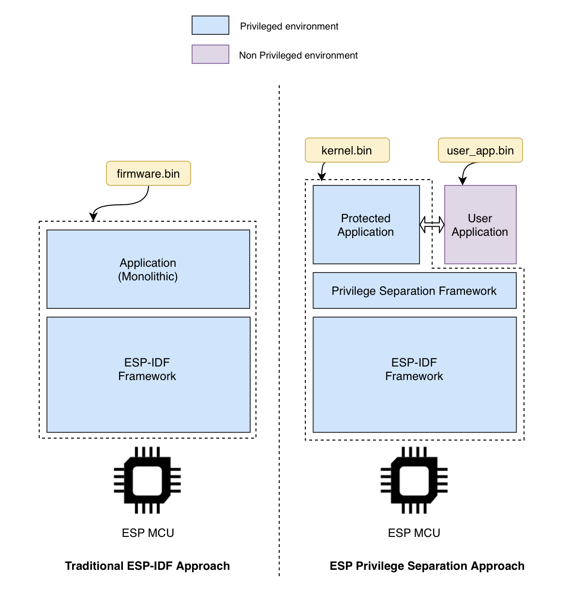

ESP Privilege Separation Programming Guide
==========================================

ESP Privilege Separation is an approach to separate out traditional monolithic RTOS firmware into 2 independent executable, protected_app and user_app with clearly defined system-call interface between them. Protected app executes in higher privilege mode, with full access to entire system memory and all peripherals whereas user application has restricted memory and peripheral access (as defined and granted by protected app).

    Framework overview

Features
--------

- Two separate independent firmware binaries generated at build time.
- Protected application contains operating system, networking stack, device drivers and hence doing bulk of heavy lifting.
  This can be customized further to include in any additional components or libraries as per requirement.
- User application is very thin, primarily using system call based interface exposed by protected app to interact and avail various services.
- Entire memory space and peripheral access is run-time configurable. Memory can be split between privileged and non-privileged environments on the fly.
- Exceptions within the user application do not hamper the functionality of the protected app.
- Enables secure and robust system behavior, as user application has only required access to system.

.. toctree::
   :hidden:

   Getting started <getting-started>
   Techincal Details <technical-details/index>
   API Reference <api-reference/index>
