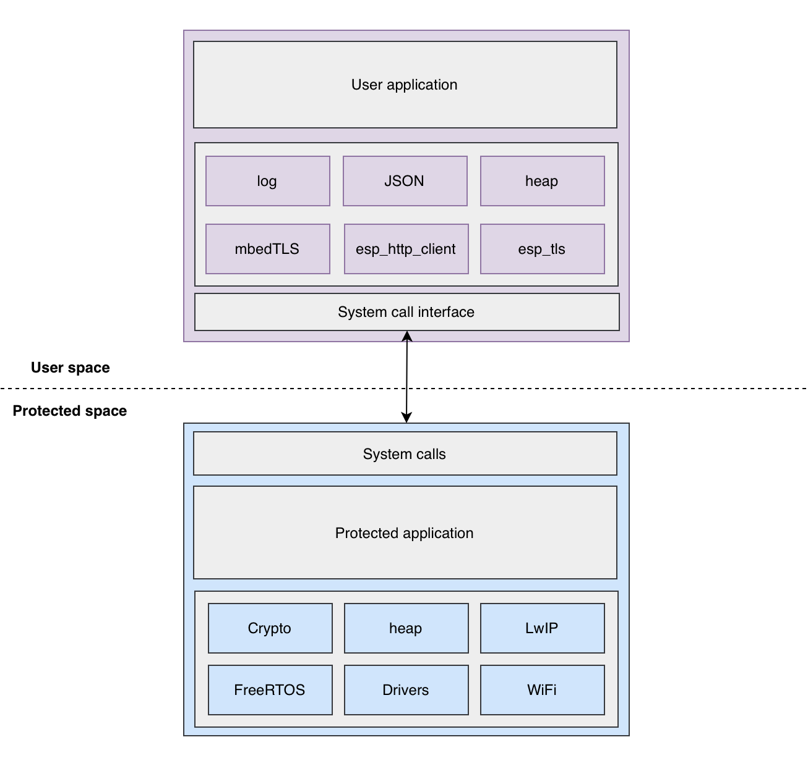

Architecture
============

Overview
--------

The firmware architecture comprises of 2 different executables:

Protected
~~~~~~~~~~

- Trusted application that has the complete system access and is isolated from user applications.
- Consists of crucial ESP-IDF components like FreeRTOS, WiFi, Networking stack.
- Exposes system calls to the user space which allows user application to delegate functions to protected space as it requires access to critical features (OS, networking).

User
~~~~~

- Consists of system call interface that can be used to request protected app to execute a service in protected space.

  - A ``vTaskDelay()`` from the user-space will internally be redirected to ``usr_vTaskDelay()`` which actually executes the system call.

- Untrusted application logic in order to safeguard from hampering the entire system.

Component Split
---------------

Core components, like FreeRTOS, LwIP, Drivers, Crypto, which are critical to the system are kept in protected space and they are
exposed to user app through system calls. This ensures that user app uses the critical services in a controlled environment.

Components which are not critical, like mbedTLS, JSON parser, etc can be placed in protected as well as user apps. The component
split is flexible and it depends on the use case and the design decisions taken by the developer.

Any non critical component can be placed as follows:

- Residing in protected app with system calls implemented:

   The protected app uses the APIs from the component and it also implements the system calls for its API as instructed in
   :ref:`System call implementation<adding_system_call>`.
   When the user app tries to use the APIs from this component, it will be translated to its system call (Refer :ref:`Translation to system call<trans_syscall>`).

- Separate instance in protected as well as user app:

   The protected app has its own copy of the component and user app, too, has its own copy of the component. When user app uses
   the APIs from this component, its entire definition will be placed in user app. Both instances of the component are
   independent and have no knowledge of each other. ``heap`` component is one such example; protected app and user app have
   independent heap allocator instances.

Bootup Flow
-----------

- The `boot-up process <https://docs.espressif.com/projects/esp-idf/en/release-v4.3/esp32c3/api-guides/startup.html>`_ of the ESP-IDF application stays the same. ``app_main`` is essentially the entry point of our protected app.
- Protected app is responsible for setting permissions, configuring memory regions and loading the user application from flash. It also exposes a set of system calls that user can invoke in order to request certain resources (creating a task, accessing peripherals, etc).
- User app depends upon the permissions granted by the protected app and has to work within those boundaries. If the user app wants to perform certain privileged operation then it needs to invoke the system calls provided by the protected app.
