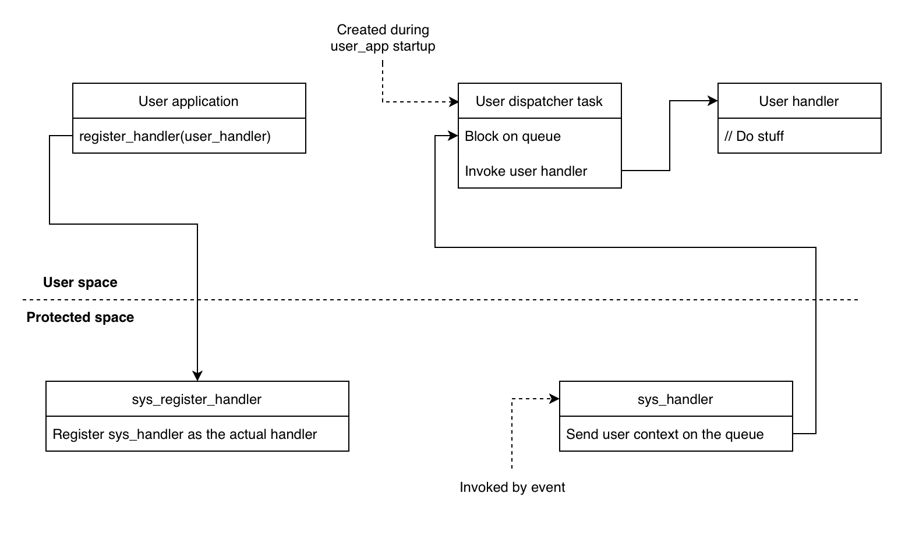

Design choices
==============

Separate stack for servicing system calls
-----------------------------------------

In order to avoid leaking any protected space data to user space, it is
mandatory to use a separate stack when servicing system calls.

Each user task will have 2 stacks:

-  User stack: This stack will be in user accessible memory region. It
   will be used for user accessible function calls.
-  Kernel stack: This stack will be in protected accessible memory
   region. The system call handler will switch to this stack when
   servicing system calls for the particular task.

Currently, the size of kernel stack is kept **2560**. Breaking the system calls into
smaller chunks might allow us to reduce the kernel stack size.

Data handling during context switch
-----------------------------------

During context switches, it is required to store certain task specific
data to ensure that when the particular task is again given execution,
it can continue without losing any data/state.

-  ``TCB`` of all tasks are stored in **protected** accessible region
   and therefore we use ``FreeRTOS's Task Local Storage(TLS)`` pointers
   in order to store the **kernel stack frame**, the **WORLD**, and the **errno** variable
   of the user code.
-  Rest of the data (registers, variables) are stored on the stack that
   is currently being used (protected or user).

.. note::
    It is possible to context switch a task that is currently
    servicing a system call.

User space interrupt/event handling
-----------------------------------

Interrupt handlers and event handlers registered by user application has to be
executed under user space. For this, we have employed a dispatching mechanism shown below:

.. note::
    The user handlers are never executed in ISR context and
    their invocation depends on the priority of the user dispatcher task.

In this case, as the interrupt handlers are never executed in the ISR context, we propose renaming
APIs with "isr" keyword to "softisr" for user space. This conveys the actual behavior of the function.

This mechanism takes **1275** extra CPU cycles to reach the user registered handler when the priority of
the user dispatcher task is kept highest. It may vary across different scenarios.

.. _driver_devel:

Driver development
------------------

User application can be easily granted access to peripherals by using ``esp_priv_access_set_periph_perm()``.
But simply providing access to peripheral isn't enough. A driver is needed to carry out the required
operation. Although user app developer can write a driver for the granted peripheral, it is inefficient.
We propose implementing the driver in the protected application and exposing it to user through VFS
(Virtual File System) system calls (open, read, write, close, etc). This approach differs from
the traditional ESP-IDF driver which has peripheral specific esp_<periph>_init(), esp_<periph>_write(), etc.

It is the responsibility of the protected app developer to encapsulate a driver in VFS function calls.
For example, we have encapsulated the existing ESP-IDF SPI driver here :component_file:`drivers/spi/vfs_spi.c`.
The system calls for file operation functions (open, etc) are already implemented so there is no need to register
any extra system calls. Registering the VFS peripheral driver from the protected application is enough and user
application can use it by simply calling the file system functions with the appropriate path.
