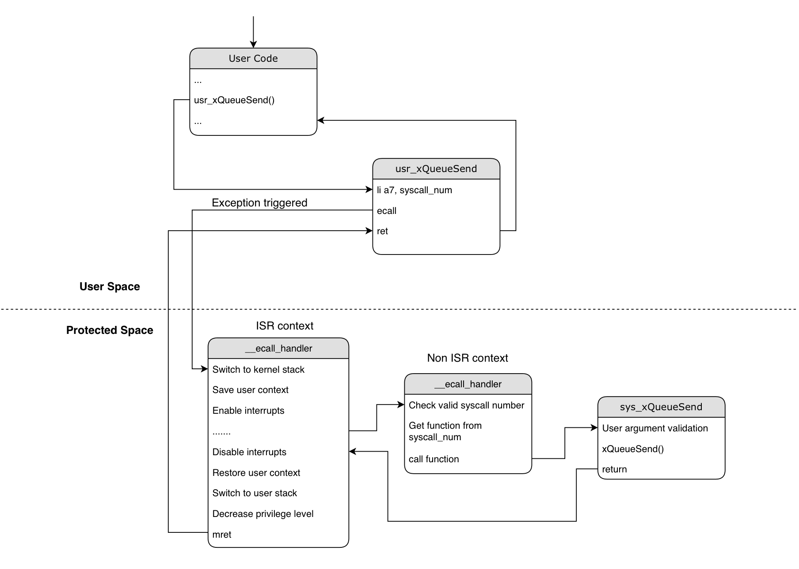

System call
===========

Implementation
--------------

``ecall`` instruction is used to generate a synchronous exception and
land into protected space from user space.

We use ``ecall`` to provide a routine from which user space application
can call protected space functions.

    System call implementation

Structure of a simple system call can be described as follows:

-  Arguments used by the system call go into ``a0``-``a6`` register.
-  System call number goes into ``a7``.
-  Return value is returned in ``a0`` register, just like normal RISCV
   calling convention.

::

       li  a0, <val_0>       -- First argument required by system call
       li  a1, <val_1>       -- Second argument
       li  a2, <val_2>       ...
       li  a3, <val_3>       ...
       li  a7, <ecall_num>   -- System call number
       ecall                 -- Generate synchronous exception
       ret                   -- Return from system call

*List of supported system calls can be
found*  \ :component_file:`here <../components/esp_syscall/syscall/syscall.tbl>`.

.. _adding_system_call:

Adding custom system call
-------------------------

To add your own custom system call, you will need to perform 5 steps:

.. _1-create-a-custom-syscall-table:

1. Create a custom system call table
^^^^^^^^^^^^^^^^^^^^^^^^^^^^^^^^^^^^

Create a .tbl file in example or component to declare custom system calls.

::

    touch <path/to/tbl/file>/custom_syscall.tbl

.. _2-assign-new-system-call-number:

2. Assign new system call number
^^^^^^^^^^^^^^^^^^^^^^^^^^^^^^^^

System calls supported by the framework are present inside :component_file:`syscall.tbl <../components/esp_syscall/syscall/syscall.tbl>`. This default table along with custom system call table is parsed by scripts and generates relevant header
files which are used in applications. You will need to add your own system
call entry in the custom table. Choose a number that isn't being used by the default system call table and
add it in the table following the convention:

::

   123   common   custom_func     sys_custom_func

``123`` is the system call number assigned to your ``custom_func``.

| ``common`` attribute indicates that the system call shares the exact
  same prototype with the ESP-IDF equivalent function. This enables the user
  application to call the function without usr\_ prefix (e.g xQueueSend
  instead of usr_xQueueSend). Build system maps the function to its
  relevant system call wrapper.

| Functions that have a different prototype can be marked ``custom`` to
  indicate the build system to not map the particular function and user
  application is expected to call that function with ``usr_`` prefix.

``sys_custom_func`` is the entry point of the system call in protected
space.

.. _3-user-system-call-implementation:

3. User system call implementation
^^^^^^^^^^^^^^^^^^^^^^^^^^^^^^^^^^

Implement wrapper function that will invoke ecall with the system call
number. Create a source file custom_wrappers.c in example or
custom component, and define the wrapper function which can be called
from user application:

::

   int usr_custom_func(void *args)
   {
       EXECUTE_SYSCALL(args, __NR_custom_func);
       return 0;
   }

``__NR_custom_func`` is the system call number that you assigned in the
system call table. This macro is generated from a script and is placed
in ``syscall_def.h`` file, created during build process.

``EXECUTE_SYSCALL`` is a macro defined in :component_file:`syscall_priv.h <../components/esp_syscall/src/syscall_priv.h>` file.

All such wrapper functions for default system calls are defined in
:component_file:`syscall_wrappers.c <../components/esp_syscall/src/syscall_wrappers.c>`.

.. _4-protected-system-call-implementation:

4. Protected system call implementation
^^^^^^^^^^^^^^^^^^^^^^^^^^^^^^^^^^^^^^^

Implement the function for system call. This will be called in protected
space whenever a syscall request with the corresponding system call
number is invoked. To implement the function for system call, create a
source file custom_syscalls.c and define the custom_function in this file.

::

   int sys_custom_func(void *args)
   {
       //Carry out the intended task
   }

The name of the function should be the same as the name mentioned in the
4th column in ``custom_syscall.tbl`` file.

All the system call functions for default system calls are defined in
:component_file:`esp_syscalls.c <../components/esp_syscall/src/esp_syscalls.c>`

.. _5-build-system-changes-to-add-custom-system-calls:

5. Build system changes to add custom system calls
^^^^^^^^^^^^^^^^^^^^^^^^^^^^^^^^^^^^^^^^^^^^^^^^^^

Set ``CUSTOM_SYSCALL_TBL`` CMake variable in the project CMakeLists.txt
with the path to custom system call table files. CUSTOM_SYSCALL_TBL
can specify path to multiple system call table files, build system will
parse and add system calls from all the specified files.

::

    set(CUSTOM_SYSCALL_TBL <path/to/tbl/file>/custom_syscall1.tbl
                           <path/to/tbl/file>/custom_syscall2.tbl)

In the custom component or main component, build custom_syscalls.c
source file in the protected app build process and build custom_wrappers.c
source file in user app build process.

::

    if(USER_APP_BUILD)
        set(srcs <path/to/custom/wrappers>/custom_wrappers.c)
    else()
        set(srcs <path/to/custom/syscalls>/custom_syscalls.c)
    endif()

    idf_component_register(SRCS ${srcs})

.. _trans_syscall:

Translation of API to system call
---------------------------------

Most of the core components (FreeRTOS, LwIP, etc) in user space are invoked through system calls yet
their function prototype is the same in protected space as well as user space.

::

    /* When invoked from the protected_app, it will call xTimerCreate
     * When invoked from the user_app, it will be translated to usr_xTimerCreate
     * which is a system call
     */
    timer = xTimerCreate("oneshot", 100 / portTICK_PERIOD_MS,
                         pdTRUE,
                         (void *)&timer_id,
                         timer_callback);

As can be seen, user app do not need to adopt any different API prototype for most of the components. There are exceptions
for some APIs and those can be found declared in syscall_wrapper.h

This translation of an API (e.g. xTimerCreate) to its system call (e.g usr_xTimerCreate) is done using linker magic.
While builing the user app, we parse syscall.tbl file for all the system calls that have ``common`` ABI and use
``--defsym`` option of the linker to do the trick. ``--defsym`` creates a global symbol with provided absolute address
so using it like ``--defsym=<symbol>=usr_<symbol>`` replaces the references to ``<symbol>`` with ``usr_<symbol>`` and thats
how xTimerCreate will be translated to usr_xTimerCreate when built from user app.

Performance impact of system call
---------------------------------

Executing a system call has an extra overhead of some CPU cycles. These extra CPU cycles are spent
in transitioning between user and protected space, switching between stacks, and saving/restoring context.

=================== ===============
 State transition    CPU cycles
=================== ===============
 User -> Protected       125

 Protected -> User        95
=================== ===============

User -> Protected
    From the point of system call invocation till the first instruction of actual system call in protected space
    i.e. CPU cycles required from usr_xTimerCreate to start executing sys_xTimerCreate.

Protected -> User
    From the point of actual system call returning till the next instruction after usr call
    i.e. CPU cycles required to return from sys_xTimerCreate and start the next instruction after usr_xTimerCreate.
