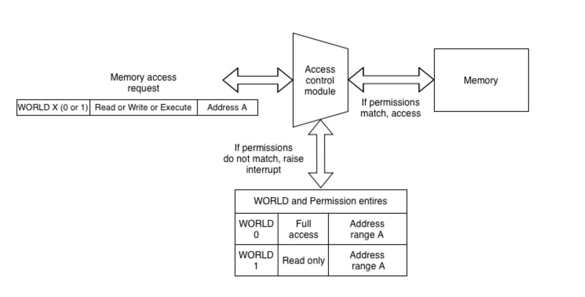

World and Permission Control
============================

ESP32-C3 has introduced two peripherals that can create separate execution environments and
manage access to internal memory, external memory, and all the peripherals for the respective execution environment.

- **World controller**

World controller manages the execution environment of the CPU.
It supports two environments: World 0 (Secure World) and World 1 (Non-secure World).
It can also switch between these environments seamlessly depending on the configuration.

- **Permission controller**

Permission controller manages access permissions for the entire memory, internal and external, and all the
peripherals. Each World has its own set of permissions and is independently configurable.

Permission controller can also be configured to raise a violation interrupt in case there is unauthorized access by any of the World.
It also captures information about the unauthorized access such as the violating World, the memory address, and the requested action (Read, Write or Execute).

The above diagram provides an overview of the permission control module at the hardware level.
Each memory/peripheral access request has a World attribute. This indicates the current World of the requesting module.
In the above scenario, if the CPU executing in World 1 tries to write to any address in Address range A,
the permission controller would raise a violation interrupt because it is configured deny
write access to Address range A by World 1. The read request on the same address would be successful as read access is permitted.

Switching between Secure and Non-secure World
~~~~~~~~~~~~~~~~~~~~~~~~~~~~~~~~~~~~~~~~~~~~~

- Switching from Secure to Non-Secure World:

CPU can be switched to non-secure world by configuring the address in World controller register.
When CPU tries to execute the configured address, it will transparently switch and execute in the non-secure world.

::

        void main(void) {

            ...
            ...
            WORLD_PREPARE      = 1 << 1                     -|
            WORLD_TRIGGER_ADDR = <Address of func foo>       |- WORLD controller configuration to switch to Non secure
            WORLD_UPDATE       = 1                          -|  World when CPU executes function `foo`
            ...
            ...

            foo();                                          -> When CPU executes the first instruction of func foo,
                                                               World controller will switch CPU to non-secure World
            ...
       }

You can find the implementation in :component_file:`wcntl_ll.h <../components/protected/esp_priv_access/include/wcntl_ll.h>`.

- Switching from Non-secure to Secure World:

CPU can only switch from non-secure to secure world via interrupts or exceptions.
Any interrupt (or exception) in the system will cause the CPU to switch to secure world.
