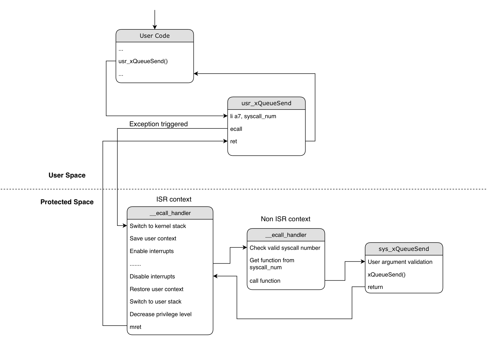

# Technical details

## System call Implementation

`ecall` instruction is used to generate a synchronous exception and land into protected space from user space.

We use `ecall` to provide a routine from which user space application can call protected space functions



Structure of a simple system call can be described as follows:
- Arguments used by the system call go into `a0`-`a6` register
- System call number goes into `a7`
- Return value is returned in `a0` register, just like normal RISCV calling convention

```asm
    li  a0, <val_0>       -- First argument required by system call
    li  a1, <val_1>       -- Second argument
    li  a2, <val_2>       ...
    li  a3, <val_3>       ...
    li  a7, <ecall_num>   -- System call number
    ecall                 -- Generate synchronous exception
    ret                   -- Return from system call
```
*List of supported system calls can be found [here](../components/esp_syscall/syscall/syscall.tbl)*

## Adding custom system call

To add your own custom system call, you will need to perform 3 steps:

#### 1. Assign new system call number

All the supported system calls are inside [syscall.tbl](../components/esp_syscall/syscall/syscall.tbl). This table is parsed by scripts and generates relevant header files which are used in applications.
You will need to add your own system call entry in this table. Choose a number that isn't being used already and add it in the table following the convention

```
123   common   custom_func     sys_custom_func
```

`123` is the system call number assigned to your `custom_func`.

`common` attribute indicates that the system call shares the exact same prototype with the IDF equivalent function. This enables the user application to call the function without usr_ prefix (e.g xQueueSend instead of usr_xQueueSend). Build system maps the function to its relevant system call wrapper.  
Functions that have a different prototype can be marked `custom` to indicate the build system to not map the particular function and user application is expected to call that function with `usr_` prefix.

`sys_custom_func` is the entry point of the system call in protected space.

#### 2. User system call implementation

Implement wrapper function that will invoke ecall with the system call number. All such wrapper functions are defined in [syscall_wrappers.c](../components/esp_syscall/src/syscall_wrappers.c)
Define the wrapper function which can be called from user application

```
int usr_custom_func(void *args)
{
    EXECUTE_SYSCALL(args, __NR_custom_func);
    return 0;
}
```

`__NR_custom_func` is the system call number that you assigned in the system call table. This macro is generated from a script and is placed in `syscall_def.h` file, created during build process

`EXECUTE_SYSCALL` is a macro defined in [syscall_priv.h](../components/esp_syscall/src/syscall_priv.h) file

#### 3. Protected system call implementation

Implement the function for system call. This will be called in protected space whenever a syscall request with the corresponding system call number is invoked. All the system call functions are defined in [esp_syscall.c](../components/esp_syscall/src/esp_syscalls.c) and define the custom_function in this same file

```
int sys_custom_func(void *args)
{
    //Carry out the intended task

}
```

The name of the function should be the same as the name mentioned in the 4th column in `syscall.tbl` file

<ins>Once the above steps are done, you will need to re-build protected and user application.</ins>

## Current design choices

### Separate stack for servicing system calls

In order to avoid leaking any protected space data to user space, it is mandatory to use a separate stack when servicing system calls.

Each user task will have 2 stacks:
- User stack: This stack will be in user accessible memory region. It will be used for user accessible function calls
- Kernel stack: This stack will be in protected accessible memory region. The system call handler will switch to this stack when servicing system calls for the particular task.

Currently, the size of kernel stack is kept **3072** because some of the TLS system calls require more stack. Breaking the system calls into smaller chunks might allow us to reduce the kernel stack size

### Data handling during context switch

During context switches, it is required to store certain task specific data to ensure that when the particular task is again given execution, it can continue without losing any data/state.

- `TCB` of all tasks are stored in **protected** accessible region and therefore we use `FreeRTOS's Task Local Storage(TLS)` pointers in order to store the **kernel stack frame** and the **WORLD** of the user code.
- Rest of the data (registers, variables) are stored on the stack that is currently being used (protected or user).

*Note that it is possible to context switch a task that is currently servicing a system call*
